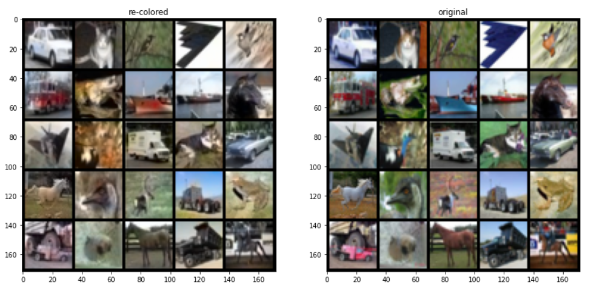
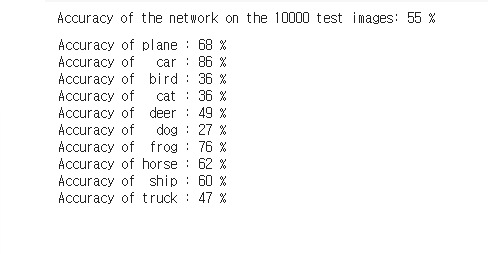

# colorization
흑백의 이미지에서 color을 추출하는 프로그램

- http://places2.cspython train_placesCNN.py -a resnet18 /xxx/yyy/places365standard_easyformatail.mit.edu/download.html
- 첨부한 링크에서 Place365-Standard dataset (download --> samll images 256*256 validation images (501MB))
- 다운로드 받은 val_256.tar에는 PLACES365_VAL_00000001.jpg부터 PLACES365_VAL_00036500.jpg이 저장되어 있음
- 001부터 300까지 300개의 image을 training set으로 사용하고 301부터 400까지 100개의 image을 validation set으로 사용
- 프레임워크는 Google Colab을 사용

2020년 12월 19일 토요일
- colab에서 cnn 예제 실행
- 201219 폴더에 코드 첨부
- 첨부한 코드는 google colab을 사용하여 실행

2020년 12월 20일 일요일
- Colab에서 Google drive mount
- https://blog.naver.com/wideeyed/221564411127

- Python에서 tensorflow을 사용하여 model 생성
  - xor 연산을 학습하여 checkpoint로 가중치 파일 생성
  - predict 함수를 사용하여 연산 결과 출력
  - 학습한 가중치 파일을 Google drive에 저장 

2020년 12월 22일 화요일
- 12월 19일에 돌린 예제 코드에서 학습한 model에서 predict 실행
- 10000개의 test_images에 대해서 test_labels와 predict_classes을 비교했을 때 정확도는 69% (그렇게 높지 않음)
- 10번 학습했을 때와 30번 학습했을 때 정확도의 차이가 거의 없음
- model의 구조를 다르게 해볼 

2020년 12월 23일 수요일
- Grayscale에 대해서 10번, 30번 학습한 후 정확도 비교
- 10,000개의 test_images에 대해서 10번 학습했을 때 67.27, 30번 학습했을 때 65.71의 정확도가 나타남
- 여러 번 학습해도 정확도가 올라가지 않고 오히려 낮아짐
- image colorization을 검색하여 colab에서 실행
- 참고한 사이트 https://colab.research.google.com/github/smartgeometry-ucl/dl4g/blob/master/colorization.ipynb#scrollTo=urXwm66b2vhX

- 사이트에 제공된 코드를 colab에서 실행했을 때 위와 같은 결과를 얻을 수 있었음
- model을 저장하는 방법과 사진을 각각 predict 하는 방법을 알아볼 필요가 있음

2020년 12월 28일 월요일
- 인공지능개론 강의 시간에 배운 torch을 사용한 cnn 코드 실행

- epoch을 2로 설정하여 학습했을 때 전체적인 정확도와 class 정확도

- epoch을 10으로 설정하여 학습했을 때 전체적인 정확도와 class 정확도
- 정확도를 비교했을 때 학습량이 증가해도 정확도가 증가하지 않음 

2020년 12월 30일 수요일
- 마크다운 에디터 Typora 다운로드
- pdf 작성법 숙지

앞으로 진행할 사항
- 28일에 진행한 코드 정확하게 분석하기
- 정확도를 높이는 방법
- 효과적인 cnn 구조
- 사진 내에서 다수의 class 구분 또는 크기별 구분
